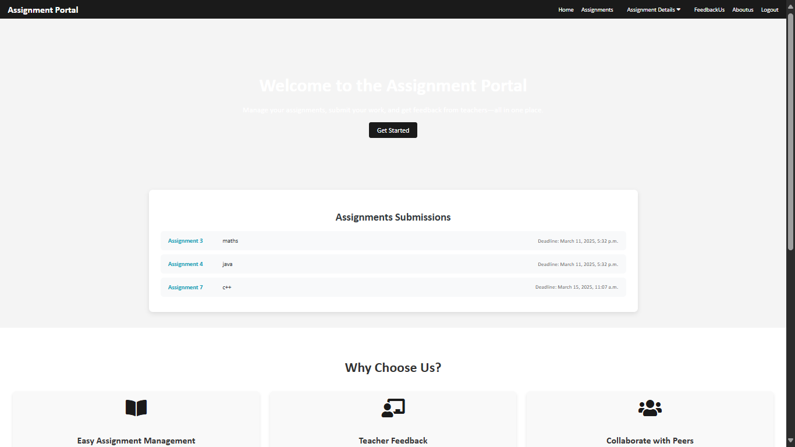

# AssignmentPortal

An **Assignment Portal** is an online platform designed to streamline the process of assignment submission, review, and grading for both students and educators. It provides a centralized space where students can securely upload their assignments, ensuring easy access for teachers to evaluate and provide feedback. These portals often integrate features such as deadline tracking, automated reminders, and role-based access, allowing administrators, teachers, and students to interact efficiently. Additionally, some assignment portals support plagiarism detection tools and automated grading mechanisms to enhance academic integrity and improve evaluation accuracy. By digitizing the assignment management process, these portals help educational institutions foster a more organized and transparent learning environment, making it easier for students to stay on top of their coursework and for teachers to manage large volumes of submissions effectively.

# LIVE PREVIEW:

## 🛠️ **Technologies Used**

- **Django**: Web framework for building the project.
- **SQLite**: Default database for the application (can be changed to PostgreSQL or MySQL).
- **HTML/CSS/JS**: Frontend technologies for the user interface.
- **Bootstrap**: Frontend framework for responsive design.

---
